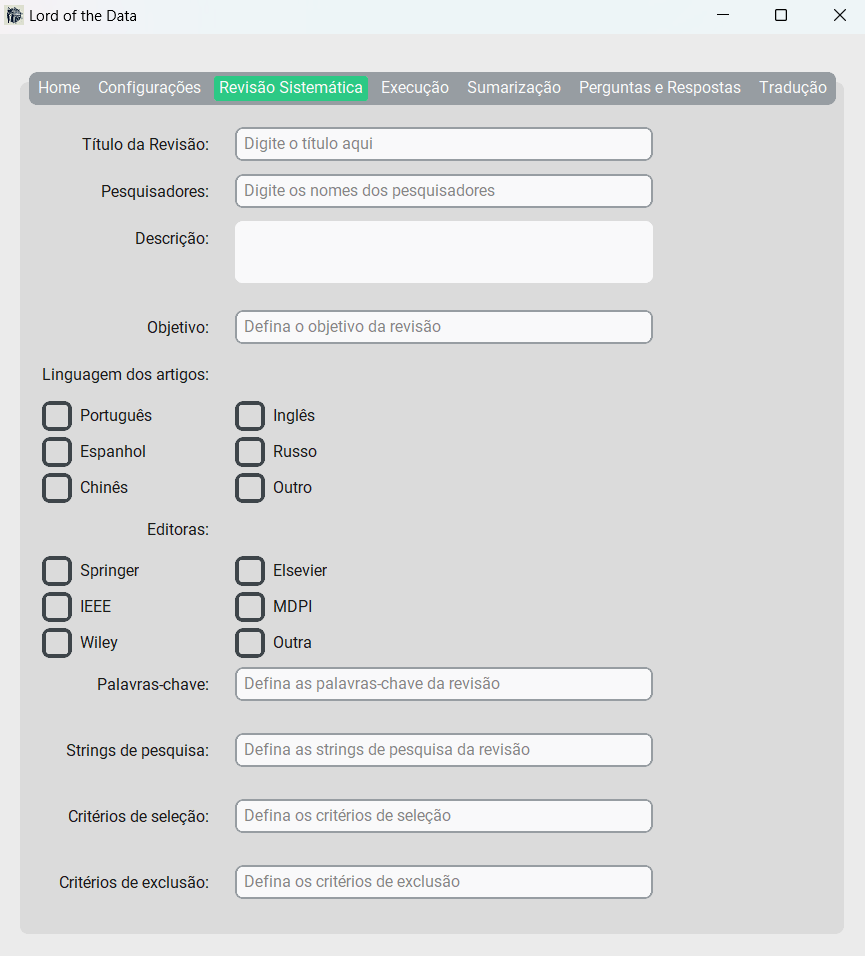
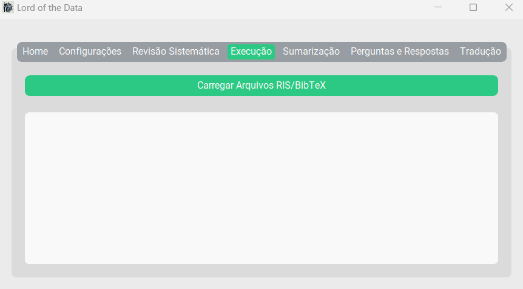
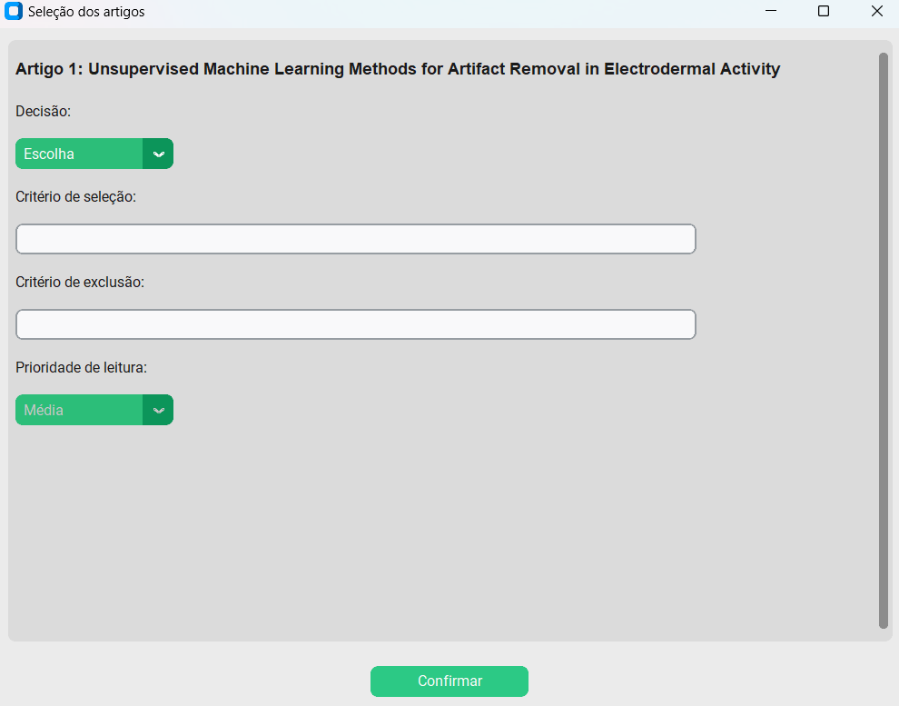

# Lord-of-the-data
Sua ferramenta para revisão sistemática de artigos científicos.

## 📘 Introdução

### O que é o software?

**Lord of the Data** é uma ferramenta desenvolvida para auxiliar no processo de revisão sistemática. Ela incrementa ferramentas que facilitam a seleção, extração e entendimento de artigos científicos, com um diferencial importante: o uso de modelos de **inteligência artificial** para sumarização e análise textual. Além disso, é um software **brasileiro**, com foco em acessibilidade e facilidade de uso.

### Público-alvo

Este software é destinado a **alunos, pesquisadores e entusiastas** interessados no processo de revisão sistemática.

### Requisitos do sistema

- **Sistema operacional:** Windows  
- **Memória RAM:** 8 GB  
- **Espaço em disco:** (a definir)  
- **Outros requisitos:** (a definir)  

---

## 🎯 Objetivos

- **Automatizar a revisão sistemática**, facilitando a coleta, filtragem e organização de artigos científicos.
- **Fornecer ferramentas de análise e extração de dados**, identificando padrões e informações relevantes.
- **Garantir transparência e reprodutibilidade**, permitindo replicar metodologias de revisão.

---

## 🔧 Funcionalidades Principais

### Visão geral da interface

A interface é composta por sete menus:

- Home
- Configurações
- Revisão Sistemática
- Execução
- Sumarização
- Perguntas e Respostas
- Tradução

---

### 🏠 Home

Apresentação do programa, incluindo:

- **Logo**: um mago simbolizando poder sobre dados.
- **Título e subtítulo**
- **Versão e autor**

---

### ⚙️ Configurações

Permite:

- **Salvar/carregar dados** da revisão
- Escolher o formato de saída (DOCX ou LaTeX)
- Alternar entre **modo claro e escuro**
- Selecionar tipo de citação (**ABNT ou Harvard**)

---

### 📚 Revisão Sistemática

Coleta dados da revisão, como:

- Título, autores, objetivo
- Critérios de inclusão/exclusão
- Palavras-chave, strings de busca
- Informações sobre editoras e idioma

---

### ▶️ Execução

Importa arquivos `.ris` e `.bib` e extrai metadados automaticamente. Utiliza o modelo [distilbert-base-uncased-distilled-squad](https://huggingface.co/distilbert/distilbert-base-uncased-distilled-squad) para responder perguntas como:

- Qual é a principal contribuição deste estudo?
- Como e por que foi conduzido?
- Quais são os principais resultados?

O sistema mostra respostas com **porcentagem de confiança**, e permite ao usuário aceitar/rejeitar artigos com base em critérios definidos.

  
  

---

### 📝 Sumarização

Permite resumir textos usando o modelo [Falconsai/text_summarization](https://huggingface.co/Falconsai/text_summarization) (T5 Small), gerando resumos concisos com base no conteúdo inserido.

---

### ❓ Perguntas e Respostas

Responde perguntas personalizadas sobre textos inseridos, usando o mesmo modelo da etapa de execução.

---

### 🌐 Tradução

Permite a tradução de textos de artigos para o idioma desejado (em desenvolvimento ou a ser detalhado).

 *(inserir se tiver imagem)*

---

## 🧪 Status do Projeto

:construction: Em desenvolvimento.  
Sinta-se à vontade para abrir *issues* ou enviar *pull requests*!

---

## Modelos de IA utilizados

Este projeto utiliza modelos de linguagem e ferramentas acessadas por meio da biblioteca `transformers` da Hugging Face, todos sob licenças permissivas como Apache 2.0 e MIT.

- **Perguntas e Respostas:**  
  [`distilbert/distilbert-base-uncased-distilled-squad`](https://huggingface.co/distilbert/distilbert-base-uncased-distilled-squad)  
  Acessado via Hugging Face Transformers  
  Licença: [Apache 2.0](https://www.apache.org/licenses/LICENSE-2.0), que permite o uso, modificação e redistribuição, desde que a licença original seja incluída.

- **Sumarização de Texto:**  
  [`Falconsai/text_summarization`](https://huggingface.co/Falconsai/text_summarization)  
  Acessado via Hugging Face Transformers  
  Licença: [Apache 2.0](https://www.apache.org/licenses/LICENSE-2.0), que permite o uso, modificação e redistribuição, desde que a licença original seja incluída.

- **Tradução de Texto:**  
  [Argos Translate](https://github.com/argosopentech/argos-translate)  
  Modelos utilizados disponíveis em: [https://www.argosopentech.com/models/](https://www.argosopentech.com/models/)  
  Licença: [MIT](https://opensource.org/licenses/MIT), que permite uso, cópia, modificação, fusão, publicação, distribuição, sublicenciamento e/ou venda do software, desde que seja mantido o aviso de copyright.

### Observações

- Os modelos são utilizados **exclusivamente por meio da API da Hugging Face** ou bibliotecas licenciadas.
- **Nenhum peso de modelo é redistribuído neste repositório**. Os modelos são baixados dinamicamente no dispositivo do usuário, conforme necessário.
- Recomendamos que usuários consultem os repositórios originais para mais informações sobre licenciamento e termos de uso.

## 👨‍💻 Autor

**Seu Nome** – [@seu_usuario](https://github.com/seu_usuario)  
Desenvolvedor e pesquisador em inteligência artificial e revisão sistemática.

---

## 📄 Licença

Este projeto está licenciado sob a Licença Creative Commons Atribuição - Não Comercial 4.0 Internacional (CC BY-NC 4.0). Você pode copiar, modificar, distribuir e executar o material para fins não comerciais, desde que atribua a autoria. O uso comercial requer permissão explícita do autor.

Veja o arquivo [LICENSE](./LICENSE) para mais detalhes.
